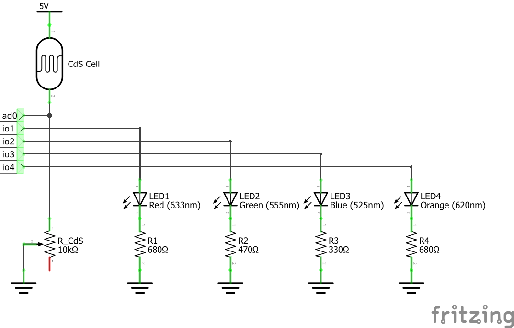

# 📱 obniz で学ぶリアルタイムIoT制御ハンズオン ( #hokkaido_js )

**hokkaido.js vol.05@Kushiro ハンズオン資料**

本資料は、2025年12月6日に開催された[hokkaido.js vol.05@Kushiro](https://hokkaido-js.connpass.com/event/363908/)のハンズオン用資料です。

obnizを使った4人同時リアルタイムIoT制御と、外部サービス（Airtable）との連携を通じて、JavaScriptによるIoTデバイス制御の基礎から実用的なWeb API連携まで、段階的に学習します。

## 📚 目次

1. [ハンズオン概要](#-ハンズオン概要)
2. [事前準備](#-事前準備)
3. [ハードウェア構成](#-ハードウェア構成)
4. [基本の流れ](#-基本の流れ)
5. [サンプルコードの動作確認](#-サンプルコードの動作確認)
6. [課題1: センサー値を%に変換](#-課題1-センサー値をに変換)
7. [課題2: スライダーを使ったLED制御](#-課題2-スライダーを使ったled制御)
8. [課題3: 自動調光ライト](#-課題3-自動調光ライト)
9. [課題4: リアルタイム状態モニタ](#-課題4-リアルタイム状態モニタ)
10. [課題5: 実用的な認証を持つログ記録](#-課題5-実用的な認証を持つログ記録)
11. [参考資料](#-参考資料)

---

## 🎯 ハンズオン概要

### 目的

obnizを通じた4人同時リアルタイム制御と、セキュアなWebサービス連携の学習。

### 仕様

| 項目 | 詳細 |
|:---|:---|
| **参加人数** | 4人（obniz 1台を共有） |
| **識別方法** | LEDポート番号を直接指定（1-4） |
| **所要時間** | 60-90分（基礎部分は60分以内） |

### タイムライン

| 時間 | 内容 |
|:---|:---|
| **0-10分** | ハンズオン説明・環境確認 |
| **10-30分** | ハードウェア構成説明・サンプルコード動作確認 |
| **30-60分** | 基本操作の理解（LED ON/OFF、センサー値取得） |
| **60-90分** | 課題1-4に挑戦（応用編） |

---

## 🔧 事前準備

### 必要な環境

参加者は以下の環境を準備してください。

- **Webブラウザ**: Chrome、Edge、Firefoxなど最新版
- **テキストエディタ**: VSCode推奨（HTML/CSS/JavaScript対応）
- **Airtableアカウント**: 課題5で使用（無料）
  - [airtable.com](https://airtable.com/)で登録

### 配布物

当日、以下を配布します。

- **LEDポート番号**: 各参加者に1-4のいずれかを割り当て
- **サンプルコード**: HTML/JavaScriptファイル
- **obniz ID**: 共有するobnizボードの識別番号
- **アクセストークン**: 必要に応じて

今回は、obnizボード側で動かすプログラムを変更していません。電源をはじめて投入したときに行なう、Wi-Fi 接続のみが設定されています。一部、Web上で設定できる項目について変更していますので、その要素に触れる際に説明します。

この資料に出てくるコードは、いずれもクライアント側で動作させるコードです。

---

## 🔌 ハードウェア構成

### 接続図

obnizボードには以下のように部品を接続します。



図1. obnizハンズオン回路図

| 接続先 | 部品 | ポート番号 | 備考 |
|:---|:---|:---|:---|
| **明るさセンサー** | CdSセル + 10kΩ半固定抵抗 | GPIO 0 (ad0) | 全員で共有 |
| **LED 1** | 赤色LED + 680Ω抵抗 | GPIO 1 (io1) | 参加者1用 |
| **LED 2** | 緑色LED + 470Ω抵抗 | GPIO 2 (io2) | 参加者2用 |
| **LED 3** | 青色LED + 330Ω抵抗 | GPIO 3 (io3) | 参加者3用 |
| **LED 4** | オレンジLED + 680Ω抵抗 | GPIO 4 (io4) | 参加者4用 |

### 配線のポイント

- LEDは極性があります（長い足が+、短い足が-）
- **anode（+側）**: 各参加者のGPIOポート（1-4）に接続
- **cathode（-側）**: GNDに接続（全LED共通）
- 抵抗値はLEDの色ごとに異なります（順方向電圧に応じて設定）
- CdSセルは5Vと10kΩ半固定抵抗で分圧回路を構成し、ad0で電圧値を読み取り

---

## 🚀 基本の流れ

### obnizとの通信の仕組み

obnizはクラウド経由でWebブラウザから制御できるIoTデバイスです。
複数のクライアント（参加者）が同時に1台のobnizに接続できます。

```
[参加者1のブラウザ] ─┐
[参加者2のブラウザ] ─┼→ [obnizクラウド] ←→ [obnizボード] ←→ [LED/センサー]
[参加者3のブラウザ] ─┤
[参加者4のブラウザ] ─┘
```

#### クラウド経由接続の特徴

- **複数人同時接続**: 同じobniz IDに最大5人まで同時接続可能（Web上で設定可能な最大数）
- **メッセージ共有**: 接続している全員でメッセージを送受信できる
- **状態同期**: 参加者全員がLEDやセンサーの状態を共有できる
- **インターネット経由**: どこからでもアクセス可能

### 複数クライアント同時接続の設定

4人が同時に接続して制御するには、クライアント側のJavaScriptコードに`local_connect: false`を設定する必要があります。

> **注意**: obnizクラウドの設定で同時接続数の上限を変更する必要があります。[obnizコンソール](https://obniz.com/ja/console)でデバイスの設定を開き、同時接続数を必要な人数（4人なら4以上）に設定してください。

> **補足**: アクセストークンが設定されているobnizに接続する場合は、[obnizコンソール](https://obniz.com/ja/console) → デバイス選択 → 「設定」→「アクセストークン」で確認できます。

---

### ステップ1: obnizへの接続

`sample/script.js` を開き、まず設定値を確認・変更します。

```javascript
// 設定値（ハードコード）
const OBNIZ_ID = '1234-5678';      // 配布されたobniz IDに変更
const LED_PORT = 0;                 // 割り当てられたポート番号（0-3）
const ACCESS_TOKEN = '';            // アクセストークン（不要なら空文字）
```

次に「ステップ1」のコメント部分に以下のコードを追加します。

```javascript
// ステップ1: 接続ボタンのイベント設定
document.getElementById('connect-btn').addEventListener('click', async () => {
    showStatus('接続中...', 'info');

    // obniz接続オプション（local_connect: false は複数人接続に必須）
    const options = { local_connect: false };
    if (ACCESS_TOKEN) {
        options.access_token = ACCESS_TOKEN;
    }

    // obnizに接続
    obniz = new Obniz(OBNIZ_ID, options);

    // 接続成功時の処理
    obniz.onconnect = async () => {
        isConnected = true;
        showStatus('接続成功！', 'success');
        showLedStatus(`ポート ${LED_PORT} のLEDを制御できます`);
        document.getElementById('control-area').classList.remove('hidden');

        // LEDオブジェクトを作成
        led = obniz.wired('LED', { anode: LED_PORT });
    };

    // 切断時の処理
    obniz.onclose = () => {
        isConnected = false;
        showStatus('切断されました', 'error');
        document.getElementById('control-area').classList.add('hidden');
    };
});
```

#### ポイント解説

- `local_connect: false`: 複数人が同時接続するために必須の設定
- `obniz.onconnect`: 接続成功時に呼ばれるコールバック関数
- `obniz.wired('LED', ...)`: LEDオブジェクトを作成

---

### ステップ2: LED ON/OFF制御

「ステップ2」のコメント部分に以下のコードを追加します。

```javascript
// ステップ2: LED ON/OFFボタンのイベント設定
document.getElementById('led-on-btn').addEventListener('click', () => {
    if (!isConnected || !led) {
        showStatus('obnizに接続してください', 'error');
        return;
    }
    led.on();
    showLedStatus(`ポート ${LED_PORT}: LED ON`);
});

document.getElementById('led-off-btn').addEventListener('click', () => {
    if (!isConnected || !led) {
        showStatus('obnizに接続してください', 'error');
        return;
    }
    led.off();
    showLedStatus(`ポート ${LED_PORT}: LED OFF`);
});
```

#### 動作確認

1. `sample/script.js` の設定値を変更
2. ブラウザで `sample/index.html` を開く
3. 「接続」ボタンをクリック
4. 「LED ON」「LED OFF」ボタンでLEDが点灯・消灯することを確認

---

### ステップ3: センサー値の取得

ステップ1の `obniz.onconnect` 内（LEDオブジェクト作成の後）に以下を追加します。

```javascript
        // センサー値の継続監視
        obniz.ad0.start(function(voltage) {
            document.getElementById('brightness-value').textContent = voltage.toFixed(2) + ' V';
        });
```

CdSセルに光を当てたり遮ったりすると、センサー値がリアルタイムで変化します。

---

### ステップ4: メッセージの送受信（発展）

参加者間でメッセージを共有することができます。

#### 送信

LED ON/OFF時にメッセージを送信するには、各ボタンのイベント内に追加します。

```javascript
// LED ON時に全員に通知
obniz.send({ type: 'led_update', port: LED_PORT, state: 'on' });
```

#### 受信

ステップ1の接続処理内（`obniz.onclose` の後）に追加します。

```javascript
    // メッセージ受信
    obniz.onmessage = (message) => {
        if (message.type === 'led_update') {
            console.log(`ポート${message.port}: ${message.state}`);
        }
    };
```

これにより、他の参加者のLED操作がコンソールに表示されます。


---

## 💻 サンプルコードの動作確認

### ファイル構成

配布されたサンプルコードは以下の構成です。

```
sample/
├── index.html          # メインのHTMLファイル
└── script.js           # JavaScript制御ロジック
```

### 動作確認手順

#### 1. 設定値を変更

`sample/script.js` を開き、冒頭の設定値を変更します。

```javascript
const OBNIZ_ID = '1234-5678';      // 配布されたobniz IDに変更
const LED_PORT = 0;                 // 割り当てられたポート番号（0-3）
const ACCESS_TOKEN = '';            // アクセストークン（必要に応じて）
```

#### 2. HTMLファイルを開く

`index.html`をWebブラウザで開きます。

#### 3. 接続

「接続」ボタンをクリックします。
接続が成功すると、以下が表示されます。

- 「接続成功！」というメッセージ
- LED制御ボタン（ON/OFF）
- センサー値の表示エリア

#### 4. LEDを点灯

「LED ON」ボタンをクリックし、自分のLEDが点灯することを確認します。

#### 5. センサー値を確認

画面に表示されるセンサー値が、CdSセルに光を当てたり遮ったりすることで変化することを確認します。

### コードの実装

上記の「ステップ1〜4」に従って `sample/script.js` にコードを追加してください。

### 動作のポイント

- **複数クライアント接続**: `local_connect: false`の設定が必須
- **LED制御**: `obniz.wired()`でLEDオブジェクトを作成し、`led.on()` / `led.off()`で制御
- **センサー値取得**: `obniz.ad0.start()`で継続監視を開始
- **メッセージ送受信**: `obniz.send()` / `obniz.onmessage`で参加者間通信

---

## 📊 課題1: センサー値を%に変換

### 目標

obnizから送られてくる電圧値（0.0-5.0V）を、パーセント表示（0-100%）に変換して表示します。

### 変換の考え方

電圧値を%に変換するには、以下の計算を行います：

```
パーセント = (電圧値 / 5.0) × 100
```

例：
- 0.0V → 0%
- 2.5V → 50%
- 5.0V → 100%

### 実装手順

#### 1. HTMLに%表示エリアを追加

`sample/index.html`のセンサー値表示部分を修正します。

```html
<div class="p-4 border rounded">
    <h2 class="text-lg font-semibold mb-3">センサー値</h2>
    <div class="space-y-2">
        <p>電圧: <span id="brightness-value" class="font-bold">--</span> V</p>
        <p>明るさ: <span id="brightness-percent" class="font-bold text-blue-600">--</span> %</p>
    </div>
</div>
```

#### 2. JavaScriptで%変換処理を追加

`script.js`のセンサー値取得部分を以下のように修正します。

```javascript
// センサー値の継続監視
obniz.ad0.start(function(voltage) {
    // 電圧値を表示
    document.getElementById('brightness-value').textContent = voltage.toFixed(2);

    // 電圧値を%に変換（5V基準）
    const percent = Math.round((voltage / 5.0) * 100);
    document.getElementById('brightness-percent').textContent = percent;
});
```

### 確認

CdSセルに光を当てたり遮ったりして、電圧値と%表示が連動して変化することを確認します。

**解答例**: `challenges/challenge1.html` と `challenges/challenge1.js` を参照

---

## 🎨 課題2: スライダーを使ったLED制御

### 目標

HTMLにスライダー要素を追加し、自分のLEDの明るさを無段階に手動制御します。

### 実装手順

#### 1. HTMLにスライダーを追加

`sample/index.html`の制御エリアに以下を追加します。

```html
<div class="mt-4">
    <h3 class="font-semibold mb-2">明るさ調整</h3>
    <input type="range" id="brightness-slider" min="0" max="100" value="50" class="w-full">
    <p class="text-center">明るさ: <span id="brightness-display" class="font-bold">50</span>%</p>
</div>
```

#### 2. JavaScriptでPWMとスライダーイベントを処理

`script.js`に以下を追加します。

```javascript
// PWMオブジェクトをグローバル変数に追加
let pwm;

// onconnect内でPWMを初期化（LEDオブジェクト作成の後に追加）
pwm = obniz.getFreePwm();
pwm.start({ io: LED_PORT });
pwm.freq(1000);  // 1000Hzに設定

// スライダーの変更イベント（ステップ2の後に追加）
document.getElementById('brightness-slider').addEventListener('input', (e) => {
    const ratio = parseInt(e.target.value);
    document.getElementById('brightness-display').textContent = ratio;

    // PWM制御
    if (pwm) {
        pwm.duty(ratio);  // デューティ比を変更
        showLedStatus(`ポート ${LED_PORT}: PWM ${ratio}%`);
    }
});
```

### 確認

スライダーを動かすと、LEDの明るさがリアルタイムに変化することを確認します。

**解答例**: `challenges/challenge2.html` と `challenges/challenge2.js` を参照

---

## 🌙 課題3: 自動調光ライト

### 目標

CdSセンサーの値に連動させ、自分のLEDの明るさを自動的に調整します。
周囲が暗くなるとLEDが明るくなり、明るくなるとLEDが暗くなる仕組みです。

### 実装手順

#### 1. センサー値監視処理を修正

`script.js`の`obniz.onconnect`内のセンサー監視部分を以下のように修正します。

```javascript
// PWMオブジェクトをグローバル変数に追加
let pwm;

// onconnect内でPWMを初期化
pwm = obniz.getFreePwm();
pwm.start({ io: LED_PORT });
pwm.freq(1000);

// センサー値の継続監視で自動調光
obniz.ad0.start(function(voltage) {
    document.getElementById('brightness-value').textContent = voltage.toFixed(2);

    // 電圧値を0-100の範囲に変換（5Vの場合）
    const sensorPercent = (voltage / 5.0) * 100;

    // 反比例計算: 暗い → LEDを明るく
    const ledRatio = Math.round(100 - sensorPercent);

    // 自動でLED明るさを調整
    if (pwm) {
        pwm.duty(Math.max(0, Math.min(100, ledRatio)));
        showLedStatus(`自動調光: センサー ${Math.round(sensorPercent)}% → LED ${ledRatio}%`);
    }
});
```

### 確認

CdSセルに光を当てたり遮ったりして、LEDの明るさが自動的に変化することを確認します。

**解答例**: `challenges/challenge3.html` と `challenges/challenge3.js` を参照

---

## 📊 課題4: リアルタイム状態モニタ

### 目標

参加者全員のLED操作と、共通のCdSセンサー値をリアルタイムで一覧表示するダッシュボードを作成します。

### 実装手順

#### 1. HTMLにモニタエリアを追加

```html
<div class="p-4 border rounded bg-purple-50">
    <h2 class="text-lg font-semibold mb-3">全体モニタ</h2>

    <h3 class="font-semibold mb-2">LED状態</h3>
    <ul class="space-y-1 mb-4">
        <li>ポート1: <span id="led-1-status" class="font-mono">--</span></li>
        <li>ポート2: <span id="led-2-status" class="font-mono">--</span></li>
        <li>ポート3: <span id="led-3-status" class="font-mono">--</span></li>
        <li>ポート4: <span id="led-4-status" class="font-mono">--</span></li>
    </ul>

    <h3 class="font-semibold mb-2">共通センサー</h3>
    <p>明るさ: <span id="common-brightness" class="font-bold">--</span> %</p>
</div>
```

#### 2. JavaScriptで状態更新を処理

```javascript
// LED ON/OFF時にメッセージを送信
document.getElementById('led-on-btn').addEventListener('click', () => {
    if (led) {
        led.on();
        obniz.send({ type: 'led_update', port: LED_PORT, state: 'on' });
        showLedStatus(`ポート ${LED_PORT}: LED ON`);
    }
});

// メッセージ受信で状態を更新
obniz.onmessage = (message) => {
    // LED状態の更新
    if (message.type === 'led_update') {
        const port = message.port;
        const statusElement = document.getElementById(`led-${port}-status`);
        if (statusElement) {
            statusElement.textContent = message.state.toUpperCase();
        }
    }

    // センサー値の更新
    if (message.type === 'sensor_update') {
        document.getElementById('common-brightness').textContent = message.percent;
    }
};

// センサー値を全員に共有
obniz.ad0.start(function(voltage) {
    const percent = Math.round((voltage / 5.0) * 100);
    obniz.send({ type: 'sensor_update', voltage: voltage, percent: percent });
});
```

### 確認

複数人で接続し、LED操作やセンサー値の変化が全員の画面に反映されることを確認します。

**解答例**: `challenges/challenge4.html` と `challenges/challenge4.js` を参照

---

## 📝 課題5: 実用的な認証を持つログ記録

LED操作やセンサー値のログをAirtableに記録し、外部サービスとの連携を学習します。

### Airtableとは

**Airtable**は、スプレッドシートとデータベースを組み合わせたサービスです。

- **視覚的**: スプレッドシート感覚で確認できる
- **REST API**: JavaScriptから簡単にアクセス可能
- **無料**: 1,200レコードまで無料
- **リアルタイム**: データがすぐに反映される

### 実装手順

#### 1. Airtableのセットアップ

##### アカウント作成

1. [airtable.com](https://airtable.com/)にアクセス
2. 「Sign up for free」をクリック
3. メールアドレスで登録（Googleアカウントでも可）

##### ベースの作成

1. ログイン後、「Add a base」→「Start from scratch」をクリック
2. ベース名を「obniz ハンズオン」に変更
3. テーブル名を「操作ログ」に変更

##### フィールドの設定

デフォルトのフィールドを以下のように変更します：

| フィールド名 | タイプ | 説明 |
|:---|:---|:---|
| Name | Single line text | 削除（使用しない） |
| ポート | Number | LEDポート番号（1-4） |
| 操作 | Single line text | 操作内容（例: LED ON） |
| 電圧 | Number | センサー電圧値 |
| タイムスタンプ | Date | 操作日時 |

> **ヒント**: フィールド名をクリックして「Customize field type」で変更できます

##### Personal Access Tokenの取得

1. 右上のアカウントアイコン→「Developer hub」をクリック
2. 「Personal access tokens」→「Create new token」
3. トークン名: 「obniz-handson」
4. スコープ: 「data.records:write」と「data.records:read」を選択
5. アクセス: 作成したベースを選択
6. 「Create token」をクリックしてトークンをコピー

> **重要**: トークンは一度しか表示されないので、必ずコピーして保存してください

##### Base IDの取得

1. ベースを開いた状態で「Help」→「API documentation」をクリック
2. 「AUTHENTICATION」セクションに表示されるURLから`app`で始まるIDをコピー
   - 例: `https://api.airtable.com/v0/appXXXXXXXXXXXXXX/操作ログ`
   - この`appXXXXXXXXXXXXXX`がBase ID

#### 2. 設定値を変更

`challenges/challenge5.js` の設定値を変更します。

```javascript
const AIRTABLE_TOKEN = 'あなたのPersonal Access Token';
const BASE_ID = 'あなたのBase ID';
const TABLE_NAME = '操作ログ';  // Airtableで作成したテーブル名
```

`TABLE_NAME` は、Airtableで作成したテーブルの名前をそのまま入力します（上記手順で「操作ログ」に変更した場合はそのまま）。

#### 3. 動作確認

1. `challenges/challenge5.html` をブラウザで開く
2. 接続してLED操作を行う
3. 「現在の状態をログに保存」ボタンでAirtableに保存
4. 「ログを読み込む」ボタンで保存されたログを確認
5. Airtableのベースを開いて、実際にデータが保存されていることを確認

### ポイント

- **REST API**: `fetch()`を使った外部APIとの通信を学習
- **認証**: Bearer Tokenを使った認証方法を理解
- **データ形式**: JSONでのデータ送受信
- **エラーハンドリング**: try-catchでのエラー処理
- **非同期処理**: async/awaitの使い方

**解答例**: `challenges/challenge5.html` と `challenges/challenge5.js` を参照

### 発展課題

余裕があれば、以下の機能を追加してみましょう：

1. **フィルタリング**: 自分のポートのログのみ表示
2. **グラフ化**: センサー値の推移をグラフで表示
3. **削除機能**: 古いログを削除する機能
4. **リアルタイム更新**: 定期的にログを自動読み込み

---

## 📚 参考資料

### obniz公式ドキュメント

- [obniz公式サイト](https://obniz.com/ja/)
- [obniz.js リファレンス](https://obniz.com/ja/doc/reference/obnizjs)

### Airtable API

- [Airtable API Documentation](https://airtable.com/developers/web/api/introduction)
- [REST API Basics](https://airtable.com/developers/web/api/rest-api-basics)

### JavaScript

- [fetch API](https://developer.mozilla.org/ja/docs/Web/API/Fetch_API)
- [async/await](https://developer.mozilla.org/ja/docs/Web/JavaScript/Reference/Statements/async_function)

---

## 🎉 まとめ

本ハンズオンでは、以下を学習しました。

1. **基礎**: obnizを使ったLED制御とセンサー値取得
2. **課題1**: 電圧値を%に変換
3. **課題2**: PWM制御による明るさ調整
4. **課題3**: センサー連動による自動制御
5. **課題4**: リアルタイム状態モニタリング
6. **課題5**: Airtableを使った外部サービス連携

これらの技術を組み合わせることで、実用的なIoTアプリケーションを構築できます。

### 次のステップ

- 複数のセンサーを組み合わせた制御
- データの可視化（Chart.jsなどでグラフ表示）
- 他のサービスとの連携（Discord、Slack、LINEなど）
- スマートフォンアプリとの連携

お疲れ様でした！